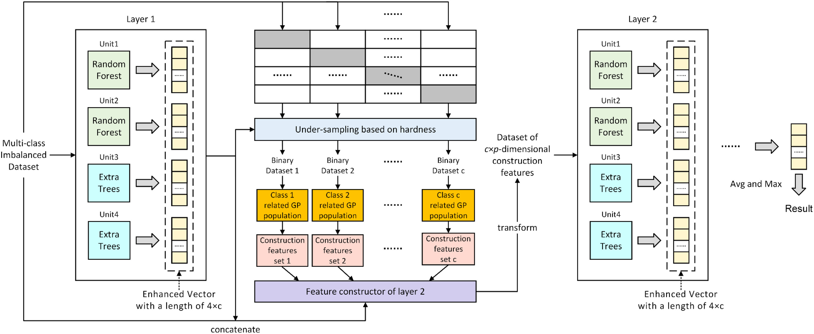

# MDGP-Forest
This repository contains the ​​Python implementation​​ of ​**​MDGP-Forest​**​ from the paper:

​​"MDGP-Forest: A Novel Deep Forest for Multi-class Imbalanced Learning Based on Multi-class Disassembly and Feature Construction Enhanced by Genetic Programming"​

## Abstract
Class imbalance is a significant challenge in the field of machine learning. Due to factors such as quantity differences and feature overlap among classes, the imbalance problem for multiclass classification is more difficult than that for binary one, which leads to the existing research primarily focusing on the binary classification scenario. This study proposes a novel deep forest algorithm with the aid of Genetic Programming (GP), MDGP-Forest, for the multiclass imbalance problem. MDGP-Forest utilizes Multi-class Disassembly and undersampling based on instance hardness between layers to obtain multiple binary classification datasets, each corresponding to a GP population for feature construction. The improved fitness function of GP assesses the incremental importance of the constructed features for enhanced vectors, introducing higher-order information into subsequent layers to improve predicted performance. Each GP population generates a set of new features that improve the separability of classes, empowering MDGP-Forest with the capability to address the challenge of overlapping features among multiple classes. We thoroughly evaluate the classification performance of MDGP-Forest on 35 datasets. The experimental results demonstrate that MDGP-Forest significantly outperforms existing methods in addressing multiclass imbalance problems, exhibiting superior predictive performance.


# Requirements
The Python environment and versions of dependency packages used in this implementation are as follows:
```
Python==3.7.16
scikit-learn==1.0.2
imbalanced-learn==0.10.1
deap==1.4.1
numpy==1.21.6
```

# Usage
We provide a demo for MDGP-Forest in the test.py file, using the Iris dataset loaded via load_iris() of sklearn. If you wish to use your own dataset, you need to preprocess it into the same format as the return value of load_iris().
```
python test.py
```

# Hyperparameter Settings
The table below shows the ​​mapping between variables in test.py and the hyperparameters of MDGP-Forest​​. You can modify these variables to configure the hyperparameters. The settings in test.py represent the ​​default hyperparameter values​​ for MDGP-Forest.
| Variables | Hyperparameters | Values |
| --- | --- | --- |
| config | Deep Forest Configuration | Refer to test.py |
| hardness_threshold | Hardness Threshold | 0.05 |
| pop_num | GP Population Size | 50 | 
| generation | GP Maximum Generations | 20 |
| feature_num | Number of Features Constructed per Population | 10 |
| cxProb | GP Crossover Probability | 0.5 |
| mutProb | GP Mutation Probability | 0.2 |

# Cite This Repository
If you use this code in your research, please cite both the ​​original paper​​ and this ​​code repository​​:
Paper Citation (BibTeX):
```
@article{LIN2026112070,
author = {Zhikai Lin and Yong Xu and Kunhong Liu and Liyan Chen},
    title = {MDGP-forest: A novel deep forest for multi-class imbalanced learning based on multi-class disassembly and feature construction enhanced by genetic programming},
    journal = {Pattern Recognition},
    volume = {170},
    pages = {112070},
    year = {2026},
    issn = {0031-3203},
    doi = {https://doi.org/10.1016/j.patcog.2025.112070},
    url = {https://www.sciencedirect.com/science/article/pii/S0031320325007307},
}
```
Code Repository
```
@software{MDGPForest_Code,
  author = {Zhikai Lin},
  title = {MDGP-Forest},
  year = {2025},
  publisher = {GitHub},
  howpublished = {\url{https://github.com/MLDMXM2017/MDGP-Forest.git}}
}
```
